# 학원 ERP 시스템

> **프랜차이즈 학원 운영을 위한 통합 ERP 시스템**  

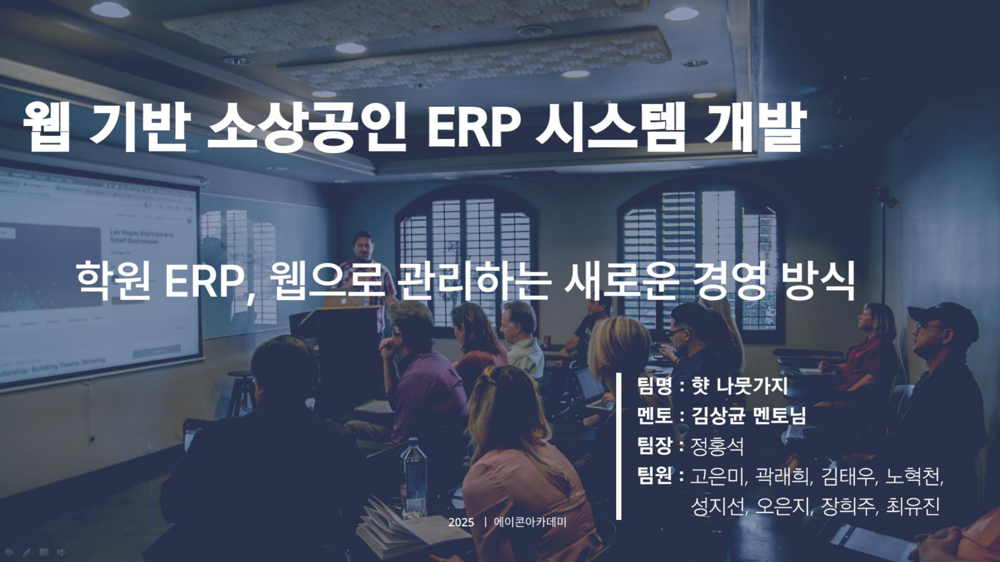

---
## 📄 발표 PDF 다운로드
- [햣 나뭇가지](./docs/햣나뭇가지최종프로젝트PDF.pdf)
  
---

## 프로젝트 기간 및 수행 절차
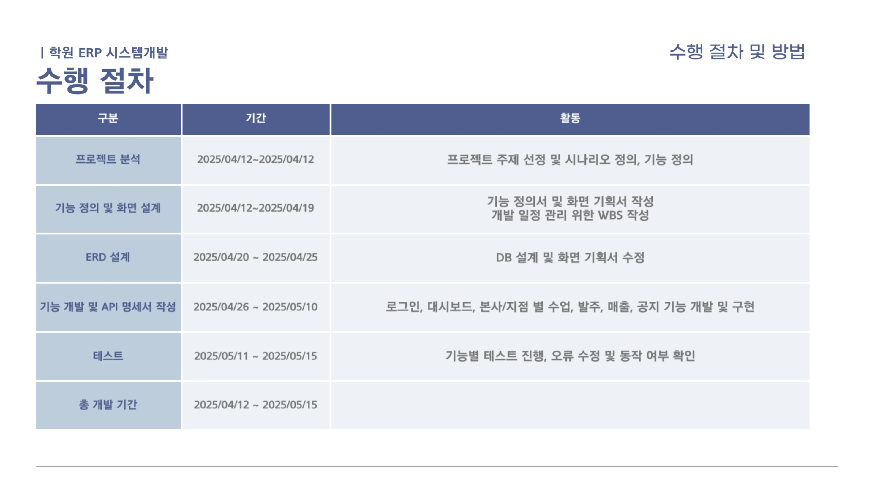

---

## 프로젝트 개요
이 프로젝트는 현재 몇몇 학원에서 이뤄지는 비효율적인 운영 방식과 본사와 지점으로 이뤄진 프렌차이즈 학원에서 매출, 발주, 수업 등을 효과적으로 관리하기 위한 웹 어플리케이션 개발을 목표로 진행했습니다. 주요 기능은 아래와 같습니다.
### 본사
- 코드 관리 : 지점 및 본사에서 사용하는 카테고리(수업, 상태, 대분류) 관리
- 공지 사항 : 지점에 공지 전송 및 파일 첨
- 발주 관리 : 지점에서 요청하는 발주 및 본사 자재 관리
- 매출 관리 : 전체 지점 통합 매출 시각화
- 지점 관리 : 지점 및 관리자 관리
### 지점 
- 학생/강사 관리
- 수업 관리 : 수업 개설 및 폐강 관리
- 발주 관리 : 발주 요청 및 기록 관리
- 매출 관리 : 과목별, 연도별 매출 시각화 

---

## 파트
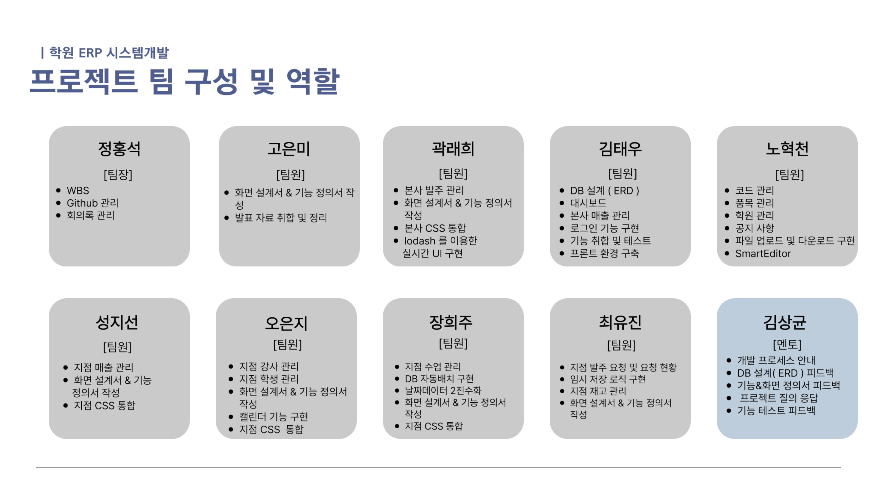
#### 나의 역할
- 전체 기획/ 
## 기술 스택
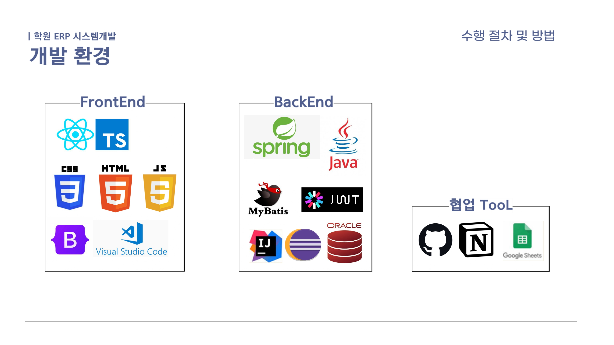

- **frontend** : React + TypeScript, BootStrap
- **Backend** : JAVA, spring boot, MyBatis
- **협업툴** : Github, Notion
- **API 문서화** : Google Sheets
- **ERD**: dbdiagram.io
- **데이터 베이스** : ORACLE DB

## 아키텍쳐
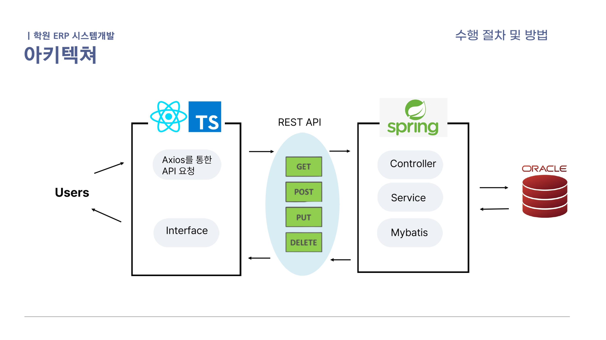
## 기능 명세서
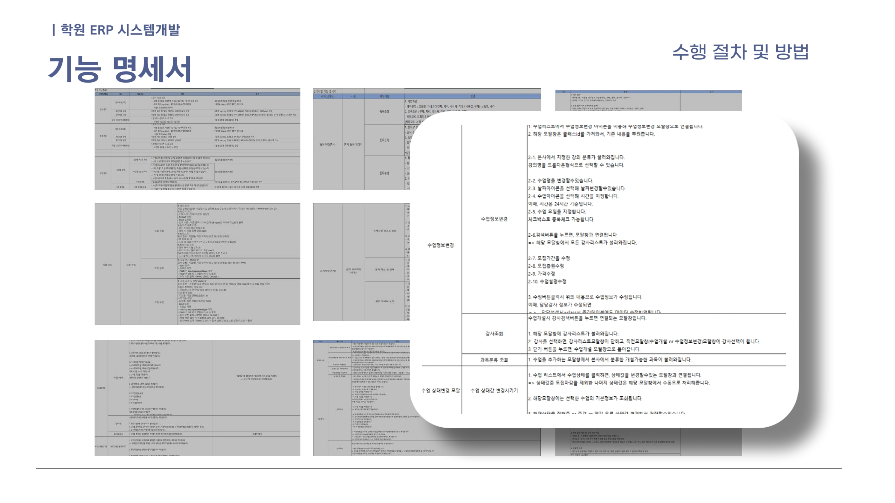
## 화면 정의서
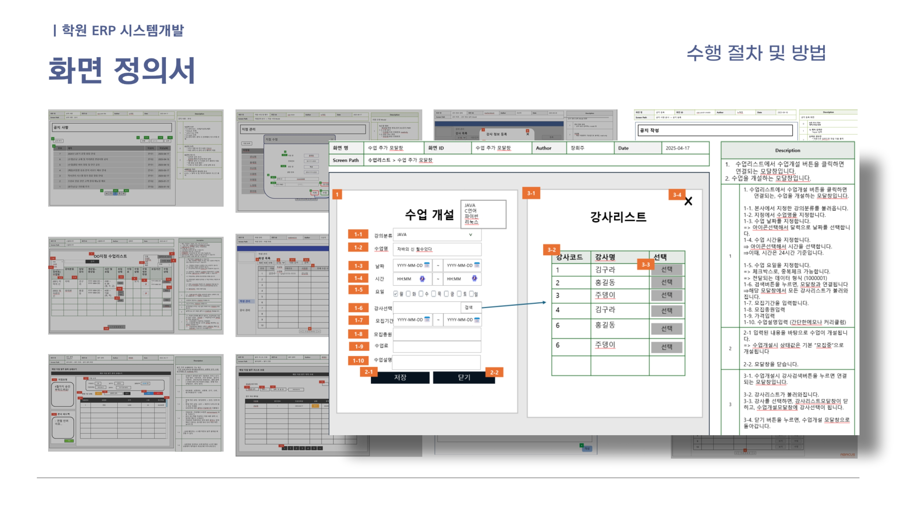
## ERD
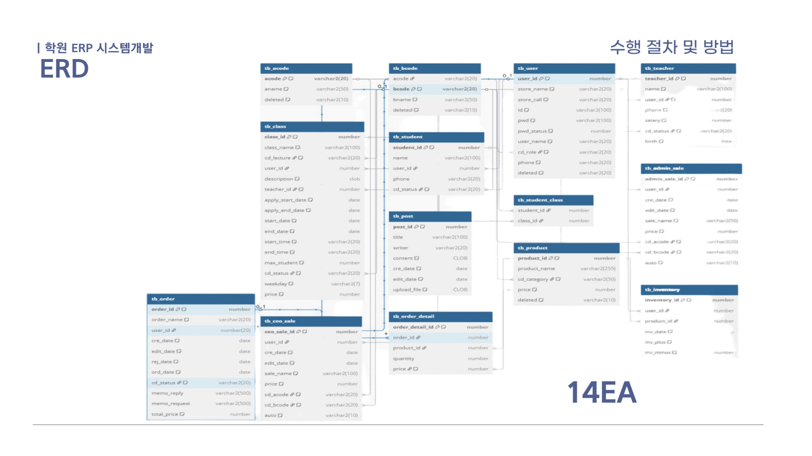
## API 리스트
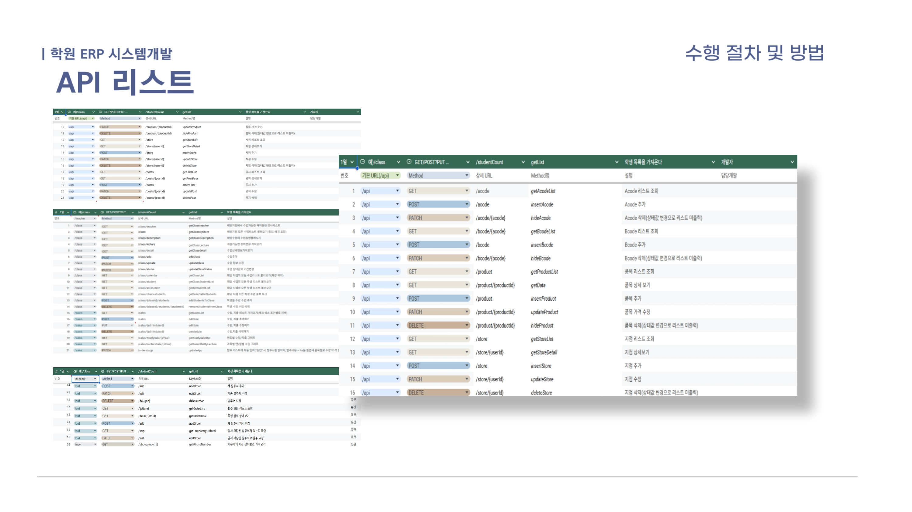
## API 정의서
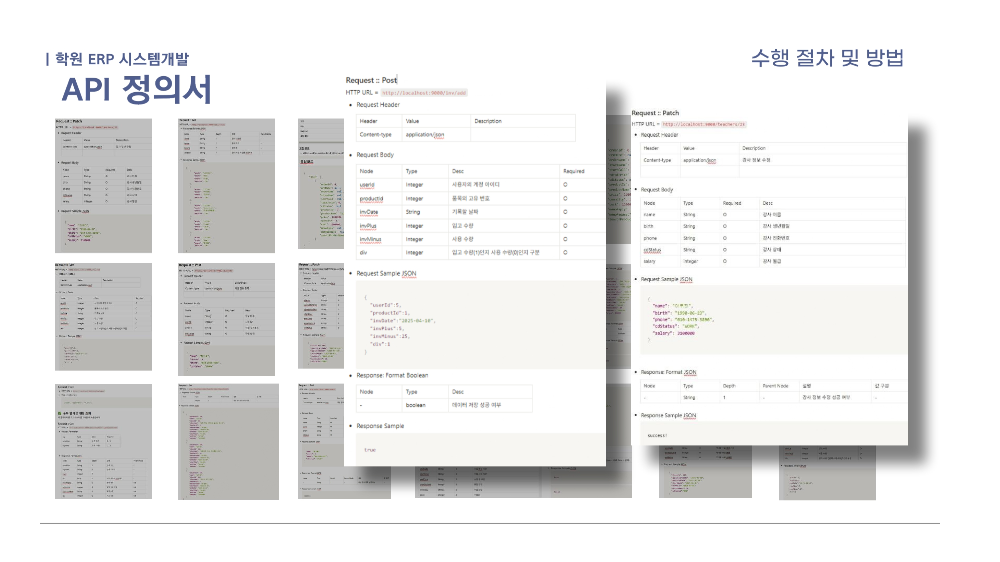
## 페이지 흐름도 - 본사
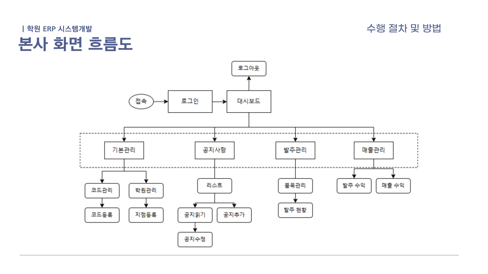
## 페이지 흐름도 - 지점
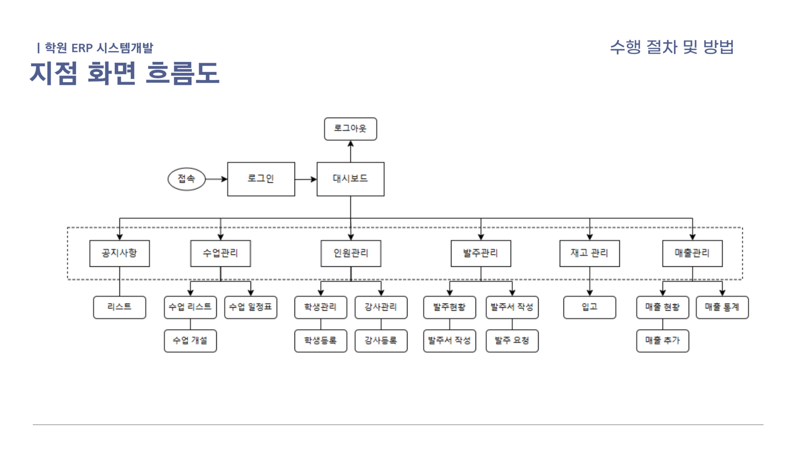

## ✍️ 회고 및 기술 블로그

개발 과정에서의 기술적 어려움과 협업 경험, 문제 해결 과정을 정리한 회고 블로그입니다.  
👉 [벨로그 회고 보러가기](https://velog.io/@gurcjs0132/파이널-프로젝트-에이콘-아카데)
